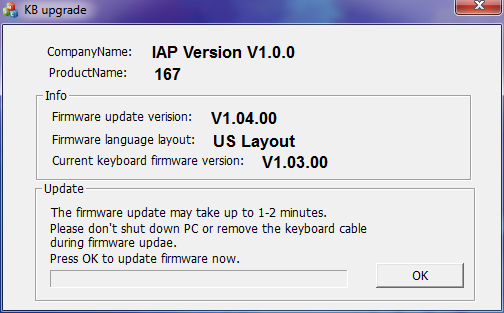

# MANUAL VORTEX POK3R RGB

### Tabla de contenido
1. [Descripción](#descripción)
1. [Características principales](#características-principales)
1. [Contenido del paquete](#contenido-del-paquete)
1. [Actualización del firmware](#actualización-del-firmware)
1. [Intrucción de teclas de programación](#instrucción-de-teclas-de-programación)
1. [Restauración por defecto](#restauración-por-defecto)
1. [Teclas Fn](#teclas-fn)
1. [Teclas compuestas Fn y Menu](#teclas-compuestas-fn-y-menu)
1. [Descripción de edición de LEDs RGB](#descripción-de-edición-de-leds-rgb)
1. [DIP Switch](#dip-switch)
1. [Otros](#otros)

### Descripción
Esta es una traducción/ampliación del [manual oficial](http://www.vortexgear.tw/db/upload/webdata4/6vortex_2017111621402892449.pdf) del teclado vortex pok3r
basado en el firmware v1.04.00. Este manuál se actualizara conforme lo haga el firmware correspondiente.

### Características principales
1. Tamaño pequeño ANSI o ISO
1. Switch Cherry MX RGB
1. Programación de tecla arbitraria y led de color
1. 3 Capas de personlización
1. Distribuciones (Qwerty, Dvorak, Colemak)
1. Bisel de metal

### Contenido del paquete
1. Teclado x1
1. Cable USB x1

### Actualización del firmware
Para realizar el procedimiento de actualización del teclado se recomienda usar sistema operativo Windows 7 o superior. Descargar el software del [sitio oficial](http://www.vortexgear.tw/vortex3.asp) y ejecutarlo.

La actualización tardará unos cuantos segundos. Al terminar no es necesario reiniciar el sistema.
Si se posee un teclado con una versión de firmware inferior a la que se muestra en la imagen el procedimiento no varia y se puede instalar la última versión.

### Instrucción de teclas de programación

- Paso 1. Escoja una capa <kbd>Fn</kbd>+<kbd><</kbd>,<kbd>></kbd> o <kbd>?</kbd> que quiera editar.
- Paso 2. Presione <kbd>Fn</kbd>+<kbd>Ctrl Derecho</kbd> para entrar en modo de programación (El led de la barra espaciadora comenzará a parpadear)
- Paso 3. Seleccione la tecla que desea programar (El led derecho de la barra espaciadora se encenderá)
- Paso 4. Introduzca el contenido de programación para la tecla y presione <kbd>Menu</kbd> (El led derecho de la barra espaciadora se prenderá de nuevo)
- Paso 5. Repita el paso 2 y el paso 3 para programar otras teclas.
- Paso 6. Presiones <kbd>Fn</kbd>+<kbd>Ctrl Derecho</kbd> para salir del modo de programación (El led de la barra espaciadora se apagará)

#### Más:
- Puede añadir tiempo de retraso, presione <kbd>Fn</kbd>+<kbd>T</kbd> cada vez para retrasar 15ms, presione <kbd>Fn</kbd>+<kbd>G</kbd> cada vez para retrasar 0.1s, presione <kbd>Fn</kbd>+<kbd>B</kbd> cada vez para retrasar 0,5s. Los retrasos consecutivos serán añadidos pero solo contaran como 1 pulsación.
- Cada tecla puede ser programada hasta 32 pulsaciones.
- Si no se presiona ninguna tecla en 15 segundos en el modo de programación, ésta volverá al modo normal.

#### Notas:
- La capa por defecto <kbd>M</kbd> no puede ser programada.

### Restauración por defecto

#### Capa actual:
Presione y mantenga presionado <kbd>Fn</kbd>+<kbd>R</kbd>, el LED izquierdo parpadeará por 5 segundo, luego la capa será restaurada a sus valores por defecto.

#### Totas las capas:
Presione y mantenga presionado ambas teclas <kbd>Alt</kbd>, esto limpiará todas las teclas programadas en las capas.

#### Observaciones: 
- Cuando resetéa la capa actual o todas las capas, el led de la barra espaciadora parpadeará y después de 5 segundos volverá a la normalidad.
- Si ha cambiado la posición de <kbd>Fn</kbd> y ha olvidado donde está. Todavía puede presionar la posición original de <kbd>Fn</kbd> y <kbd>R</kbd> para restauralo.

### Teclas Fn

<table>
	<tr align="center">
		<td rowspan="28" width="100"><kbd>Fn</kbd></td>
		<td rowspan="28">+</td>
		<td style="text-align: center;" width="100"><kbd>ESC</kbd></td>
		<td rowspan="28">=</td>
		<td width="100"><kbd>`</kbd></td>
	</tr>
	<tr align="center">
		<td><kbd>1</kbd></td>
		<td><kbd>F1</kbd></td>
	</tr>
	<tr align="center">
		<td><kbd>2</kbd></td>
		<td><kbd>F2</kbd></td>
	</tr>
	<tr align="center">
		<td><kbd>3</kbd></td>
		<td><kbd>F3</kbd></td>
	</tr>
	<tr align="center">
		<td><kbd>4</kbd></td>
		<td><kbd>F4</kbd></td>
	</tr>
	<tr align="center">
		<td><kbd>5</kbd></td>
		<td><kbd>F5</kbd></td>
	</tr>
	<tr align="center">
		<td><kbd>6</kbd></td>
		<td><kbd>F6</kbd></td>
	</tr>
	<tr align="center">
		<td><kbd>7</kbd></td>
		<td><kbd>F7</kbd></td>
	</tr>
	<tr align="center">
		<td><kbd>8</kbd></td>
		<td><kbd>F8</kbd></td>
	</tr>
	<tr align="center">
		<td><kbd>9</kbd></td>
		<td><kbd>F9</kbd></td>
	</tr>
	<tr align="center">
		<td><kbd>0</kbd></td>
		<td><kbd>F10</kbd></td>
	</tr>
	<tr align="center">
		<td><kbd>-_</kbd></td>
		<td><kbd>F11</kbd></td>
	</tr>
	<tr align="center">
		<td><kbd>=+</kbd></td>
		<td><kbd>F12</kbd></td>
	</tr>
	<tr align="center">
		<td><kbd>I</kbd></td>
		<td><kbd>↑</kbd></td>
	</tr>
	<tr align="center">
		<td><kbd>J</kbd></td>
		<td><kbd>←</kbd></td>
	</tr>
	<tr align="center">
		<td><kbd>K</kbd></td>
		<td><kbd>↓</kbd></td>
	</tr>
	<tr align="center">
		<td><kbd>L</kbd></td>
		<td><kbd>→</kbd></td>
	</tr>
	<tr align="center">
		<td><kbd>P</kbd></td>
		<td><kbd>PrtSc</kbd></td>
	</tr>
	<tr align="center">
		<td><kbd>[{</kbd></td>
		<td><kbd>ScrLk</kbd></td>
	</tr>
	<tr align="center">
		<td><kbd>]}</kbd></td>
		<td><kbd>Pause</kbd></td>
	</tr>
	<tr align="center">
		<td><kbd>Z</kbd></td>
		<td><kbd>App</kbd></td>
	</tr>
	<tr align="center">
		<td><kbd>H</kbd></td>
		<td><kbd>Home</kbd></td>
	</tr>
	<tr align="center">
		<td><kbd>N</kbd></td>
		<td><kbd>End</kbd></td>
	</tr>
	<tr align="center">
		<td><kbd>U</kbd></td>
		<td><kbd>PgUp</kbd></td>
	</tr>
	<tr align="center">
		<td><kbd>O</kbd></td>
		<td><kbd>PgDn</kbd></td>
	</tr>
	<tr align="center">
		<td><kbd>Backspace</kbd></td>
		<td><kbd>Del</kbd></td>
	</tr>
	<tr align="center">
		<td><kbd>' "</kbd></td>
		<td><kbd>Del</kbd></td>
	</tr>
	<tr align="center">
		<td><kbd>;:</kbd></td>
		<td><kbd>Ins</kbd></td>
	</tr>
</table>

### Teclas compuestas Fn y Menu

<table>
	<tr align="center">
		<td colspan="5">Cambio de Capa</td>
		<td>Observación</td>
	</tr>
	<tr>
		<td rowspan="4"><kbd>Fn</kbd></td>
		<td rowspan="4">+</td>
		<td><kbd>M</kbd></td>
		<td rowspan="4"><kbd>=</kbd></td>
		<td>Por defecto</td>
		<td>LED izquierdo de la barra espaciadora apagado</td>
	</tr>
	<tr>
		<td><kbd>,<</kbd></td>
		<td>Capa2</td>
		<td>LED izquierdo de la barra espaciadora en ROJO</td>
	</tr>
	<tr>
		<td><kbd>.></kbd></td>
		<td>Capa 3</td>
		<td>LED izquierdo de la barra espaciadora en VERDE</td>
	</tr>
	<tr>
		<td><kbd>/?</kbd></td>
		<td>Capa 4</td>
		<td>LED izquierdo de la barra espaciadora en AZUL</td>
	</tr>
</table>

<table>
	<tr>
		<td colspan="5" align="center">Teclas Multimedia</td>
	</tr>
	<tr align="center">
		<td rowspan="6"  width="100"><kbd>Fn</kbd></td>
		<td rowspan="6">+</td>
		<td width="100"><kbd>Q</kbd></td>
		<td rowspan="6">=</td>
		<td width="100">Anterior</td>
	</tr>
	<tr align="center">
		<td><kbd>W</kbd></td>
		<td>Pausa/Reproducir</td>
	</tr>
	<tr align="center">
		<td><kbd>E</kbd></td>
		<td>Siguiente</td>
	</tr>
	<tr align="center">
		<td><kbd>S</kbd></td>
		<td>Volumen -</td>
	</tr>
	<tr align="center">
		<td><kbd>D</kbd></td>
		<td>Volumen +</td>
	</tr>
	<tr align="center">
		<td><kbd>F</kbd></td>
		<td>Silenciar</td>
	</tr>
</table>

<table>
	<tr>
		<td colspan="5" align="center">Multi-Color Dinámico Luz de Fondo</td>
	</tr>
	<tr align="center">
		<td rowspan="14" width="100"><kbd>Menu</kbd></td>
		<td rowspan="14">+</td>
		<td width="100"><kbd>Esc</kbd></td>
		<td rowspan="14">=</td>
		<td width="300">Paleta</td>
	</tr>
	<tr align="center">
		<td><kbd>1</kbd></td>
		<td>Color Simple - Rojo</td>
	</tr>
	<tr align="center">
		<td><kbd>2</kbd></td>
		<td>Color Simple - Verde</td>
	</tr>
	<tr align="center">
		<td><kbd>3</kbd></td>
		<td>Color Simple - Azúl</td>
	</tr>
	<tr align="center">
		<td><kbd>4</kbd></td>
		<td>Muestra modo*2 Color Simple</td>
	</tr>
	<tr align="center">
		<td><kbd>5</kbd></td>
		<td>Muestra modo*3 Color Completo</td>
	</tr>
	<tr align="center">
		<td><kbd>9</kbd></td>
		<td>Modo de edición 1</td>
	</tr>
	<tr align="center">
		<td><kbd>0</kbd></td>
		<td>Modo de edición 2</td>
	</tr>
	<tr align="center">
		<td><kbd>-_</kbd></td>
		<td>Muestra de grabación 1</td>
	</tr>
	<tr align="center">
		<td><kbd>=+</kbd></td>
		<td>Muestra de grabación 2</td>
	</tr>
	<tr align="center">
		<td><kbd>C</kbd></td>
		<td>Disminuye el brillo</td>
	</tr>
	<tr align="center">
		<td><kbd>V</kbd></td>
		<td>Sube el brillo</td>
	</tr>
	<tr align="center">
		<td><kbd><</kbd></td>
		<td>Aumenta la velocidad del Led</td>
	</tr>
	<tr align="center">
		<td><kbd>></kbd></td>
		<td>Disminuye la velocidad del Led</td>
	</tr>
</table>

#### Nota:
- *2 Modo interactivo, Modo intermitente vortex, Modo aurora.
- *3 Modo de iluminación completo, Modo respiración, Modo Vortex, Modo lluvia.

### Descripción de edición de LEDs RGB
El POK3R RGB tiene un total de 3 capas de Leds para editar *4
- Paso 1. Escoja una capa <kbd>Fn</kbd>+<kbd><</kbd>,<kbd>></kbd> o <kbd>?</kbd> que quiera editar.
- Paso 2. Presione <kbd>Menu</kbd>+<kbd>9</kbd> o <kbd>0</kbd> para entrar en modo de edición.
- Paso 3. Presione <kbd>Menu</kbd>+<kbd>1</kbd>,<kbd>2</kbd> y <kbd>3</kbd> para combinar el color*5 o presione <kbd>Menu</kbd>+<kbd>Esc</kbd>*6 para prender la paleta y seleccionar el color que quiera.
- Paso 4. Seleccione una tecla o fila que quiera cambiar de color.
- Paso 5. Presione <kbd>Menu</kbd>+<kbd>9</kbd> o <kbd>0</kbd> para salir del modo de edición.
- Paso 6. Presione <kbd>Menu</kbd>+<kbd>-_</kbd> o <kbd>=+</kbd> para mostrar configuración guardada previa.

#### Nota:
- *4 Cada capa puede ser editada, tecla por tecla <kbd>Menu</kbd>+<kbd>9</kbd> o la fila completa <kbd>Menu</kbd>+<kbd>0</kbd>
- *5 El color elegido será mostrado en la tecla <kbd>Menu</kbd>
- *6 Hay un total de 61 tipos de colores en la paleta.

### Dip Switch

<table>
	<tr align="center">
		<th width="250">SW1</th>
		<th width="250">SW2</th>
		<td rowspan="5">=</td>
		<th width="250">Distribucíon</th>
		<th width="200">Observación</th>
	</tr>
	<tr align="center">
		<td>ON</td>
		<td>ON</td>
		<td>Colemak</td>
		<td rowspan="4">Por defecto = OFF</td>
	</tr>
	<tr align="center">
		<td>ON</td>
		<td>OFF</td>
		<td>Dvorak</td>
	</tr>
	<tr align="center">
		<td>OFF</td>
		<td>ON</td>
		<td>Qwerty</td>
	</tr>
	<tr align="center">
		<td>OFF</td>
		<td>ON</td>
		<td>Qwerty</td>
	</tr>
</table>

<table>
	<tr align="center">
		<th width="250"></th>
		<th width="250">ON</th>
		<th width="250">OFF</th>
		<th width="250">Observación</th>
	</tr>
	<tr align="center">
		<td>SW3</td>
		<td><kbd>CapsLock</kbd> = <kbd>Fn</kbd></td>
		<td><kbd>CapsLock</kbd> = <kbd>CapsLock</kbd></td>
		<td>Por defecto = OFF</td>
	</tr>
	<tr align="center">
		<td>SW4</td>
		<td>Cambia <kbd>Fn</kbd> y <kbd>Menu</kbd> a cualquier posición.</td>
		<td><kbd>Fn</kbd> y <kbd>Menu</kbd> a su posición original.</td>
		<td><kbd>R-Ctrl</kbd> no puede ser cambiada por <kbd>Fn</kbd> o <kbd>Menu</kbd></td>
	</tr>
</table>

### Otros

1. La tecla <kbd>Pn</kbd> es remmplazada por <kbd>Menu</kbd>
1. <kbd>Fn</kbd>+<kbd>Shift</kbd>+<kbd>Esc</kbd> = <kbd>~</kbd>
1. <kbd>Win</kbd>+<kbd>Alt Derecho</kbd>+<kbd>Space</kbd> convierte a las teclas de la esquina inferior derecha en teclas de dirección.